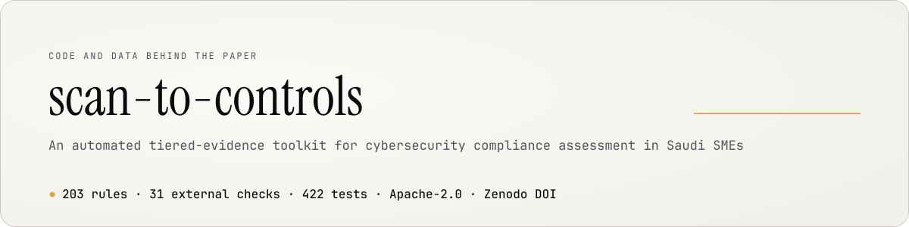

<picture>
  <source media="(prefers-color-scheme: dark)" srcset="docs/banner-dark.svg">
  
</picture>

# An automated tiered-evidence toolkit for cybersecurity compliance assessment in Saudi SMEs

Code and data behind the paper. Archived at [doi:10.5281/zenodo.22724989](https://doi.org/10.5281/zenodo.22724989).

[](https://doi.org/10.5281/zenodo.22724989)
[](LICENSE)


AlJasser AlGhamdi, Miada Almasre, Norah Al-Malki
King Abdulaziz University, Jeddah, Saudi Arabia
Contact: Miada Almasre, malmasre@kau.edu.sa

## What the paper asks

Saudi companies have to show they follow two national cybersecurity standards, ECC-2:2024 and NCNICC-1:2025. Between them that is 203 rules. Most small firms have nobody on staff to do the paperwork.

So the paper asks one question: how much of it can a single scan from outside the company answer by itself? The answer is 23 of the 203 rules, about one in nine. The rest need somebody inside the company to look, or somebody to sign for it. Everything in this repository is the code and data behind that answer.

## What is in here

| Folder | Contents |
|---|---|
| `taxonomy` | All 203 rules. Each one is labelled in one of three ways: a scan can check it, someone inside the company has to check it, or somebody has to sign a statement for it. |
| `src` | The toolkit. Thirty-one checks that read what a company exposes to the internet, the table saying which rule each check speaks to, and the part that notices when a company claims something its own website contradicts. |
| `evaluation` | The test runs and their results, as reported in the paper. |
| `scripts` | Helpers for re-running everything. |
| `tests` | 422 tests. A few skip on a fresh copy, on purpose: they need the Arabic text or the private source records, neither of which ships. |
| `test-target`, `scanner` | A small web server that answers with deliberately broken settings: expired certificates, weak keys, missing headers, and so on. The paper reports how often the checks read these correctly, and this is how you re-measure it yourself. |

## Running it

You need Python 3.13 and [uv](https://docs.astral.sh/uv/).

```bash
make install      # fetch the dependencies
make test         # run the tests
make reproduce    # re-run the evaluation
make robustness   # re-run it under different assumptions
```

Nothing drifts between runs. Same seed, same numbers, every time.

To re-measure how well the checks read a real server, start the broken-on-purpose one first and then point the matrix at it:

```bash
docker compose up -d test-matrix
uv run python evaluation/run_detector_matrix.py
```

## The companies are not real

Scanning real companies without asking them first is not something we were willing to do, so the hundred companies in the evaluation are generated. Their sizes, sectors and web footprints come from Saudi national statistics, but no real company is in the data and none can be identified from it.

## What is not in here

The official Arabic wording of the two standards. That belongs to the National Cybersecurity Authority and we are waiting on their permission. You get the rule numbers, our labels, and the English wording the Authority already publishes openly. The numbers match their documents, so anything can be looked up.

The part of the tool that scans live websites. It only runs after checking that whoever ordered the scan owns the site. Nothing here needs it, because the evaluation runs entirely on the generated companies.

## Licence

Apache 2.0. See [LICENSE](LICENSE) and [NOTICE](NOTICE).

## Cite this work

If you use these artefacts, please cite the article. The repository itself can be cited through its archive:

```bibtex
@software{alghamdi_2026_scan_to_controls,
  author    = {AlGhamdi, AlJasser and Almasre, Miada and Al-Malki, Norah},
  title     = {Tiered-evidence toolkit, control classification and evaluation artefacts for Saudi SME cybersecurity compliance},
  year      = {2026},
  publisher = {Zenodo},
  doi       = {10.5281/zenodo.22724989},
  url       = {https://doi.org/10.5281/zenodo.22724989}
}
```
